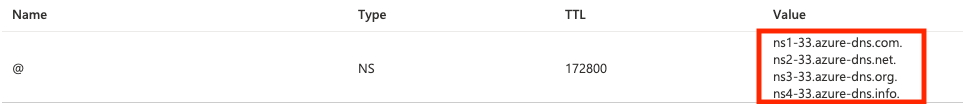
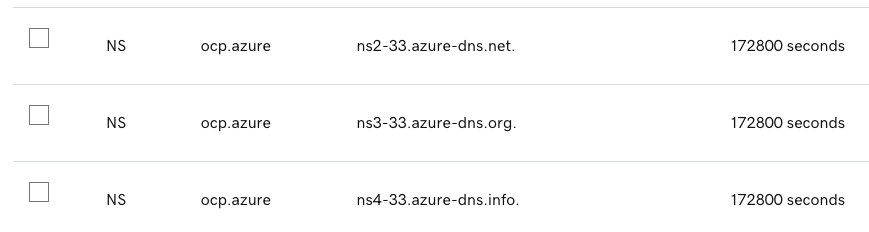

# Azure Quick Start Reference Architecture

Automation to provision the Quick Start reference architecture on Azure. This architecture implements the minimum infrastructure required to stand up a managed Red Hat OpenShift cluster with public endpoints.

## Reference Architecture


The automation is delivered in a number of layers that are applied in order. Layer (such as `110`) provisions the infrastructure including the Red Hat OpenShift cluster and the remaining layers provide configuration inside the cluster. Each layer depends on resources provided in the layer before it (e.g. `200` depends on `110`). Where two layers have the same numbers (e.g. `210`), you have a choice of which layer to apply.


<table>
<thead>
<tr>
<th>Layer name</th>
<th>Layer description</th>
<th>Provided resources</th>
</tr>
</thead>
<tbody>
<tr>
<td>105 - IBM VPC OpenShift</td>
<td>This layer provisions the Azure infrastructure and OpenShift. It will create a new VNet and other networking components required to support the OpenShift cluster. An existing registered DNS zone for the required domain name is required (refer to prerequisites).</td>
<td>
<h4>Network</h4>
<ul>
<li>Virtual network</li>
<li>VNet Master and Worker Subnets</li>
<li>Network Security Group</li>
<li>Inbound and outbound Load Balancer</li>
<li>Red Hat OpenShift cluster</li>
</ul>
</td>
</tr>
<tr>
<td>110 - Ingress Certificate</td>
<td>This layer replaces the self-signed certificates with one of two options, either auto-generated ones from LetsEncrypt or supplied certificates. This allows web browser console access to the cluster. Note that this layer invalidates the access key in the existing kubeconfig. It is necessary to get a new access key from the console to login at the command line after applying this layer.</td>
<td>
<h4>Acme Certificates</h4>
<ul>
<li>API Certificate</li>
<li>Apps certificate</li>
<li>OpenShift Cluster Update</li>
</ul>
<h4>BYO Certificates</h4>
<ul>
<li>OpenShift Cluster Update</li>
</ul>
</td>
</tr>

<tr>
<td>210 - Azure Storage</td>
<td>The storage layer has two options - default or Portworx. The default option uses Azure's storage for OpenShift persistent volumes. For quickstart, this is Premium_LRS. Other options can be configured post implementation through the OpenShift console. The Portworx option implements either a Portworx Essentials or Portworx Enterprise deployment onto the OpenShift cluster. The type of Portworx deployment is determined by the supplied Portworx specification file. </td>
<td>
<h4>Default</h4>
<ul>
<li>Azure storage class
</ul>
<h4>Portworx</h4>
<ul>
<li>Portworx operator</li>
<li>Portworx storage classes</li>
</ul>
</td>
</tr>

</tbody>
</table>

## Automation

### Prerequisites

1. Access to an Azure account with "Owner" and "User Access Administrator" roles in an Azure Subscription. The user must be able to create a service principal per the below prerequisite.

2. Install [Azure CLI](https://docs.microsoft.com/en-us/cli/azure/install-azure-cli).
    This is required to setup the service principal per the below instructions, not to deploy OpenShift. So if you already have a service principal or create the service principal via the Azure portal, than the Azure CLI is not required.

3. [Configure Azure DNS](https://github.com/openshift/installer/blob/d0f7654bc4a0cf73392371962aef68cd9552b5dd/docs/user/azure/dnszone.md).
   1. Buy or have an existing domain
   1. Decide on a subdomain of the existing domain (for example ocp.azure)
   1. Create a new resource group in your Azure subscription
   1. Create a DNS zone in the Azure resource group using the subdomain and existing domain (for example, ocp.azure.example.com)
   1. Once crated, go to your domain provider and delegate access for the new subdomain to Azure domain name servers provided in the Azure DNS zone. Note that the TTL should match. 

    Azure DNS Zone
    

    Domain Provider Delegation
    

4. [Create a Service Principal](https://github.com/openshift/installer/blob/d0f7654bc4a0cf73392371962aef68cd9552b5dd/docs/user/azure/credentials.md) with proper IAM roles.
    1. Create the service principal account if it does not already exist:
        ```shell
         az ad sp create-for-rbac --role Contributor --name <service_principal_name> --scopes /subscriptions/$SUBSCRIPTION_ID
        ```
        where SUBSCRIPTION_ID is the Azure subscription where the cluster is to be deployed and `service_principal_name` is the name to be assigned to the service principal. 
        Make a copy of the details provided
        ```json
        "addId":"<this is the CLIENT_ID value>",
        "displayName":"<service principal name>",
        "password":"<this is the CLIENT_SECRET value>",
        "tenant":"<this is the TENANT_ID value>"
        ```

    1. Assign Contributor and User Access Administrator roles to the service principal if not already in place.
        ```shell
        az role assignment create --role "User Access Administrator" --assignee-object-id $(az ad sp list --filter "appId eq '$CLIENT_ID'" | jq '.[0].id' -r)
        ```
        where $CLIENT_ID is the appId of the service principal created in the prior step.

5. Get your [OpenShift installer pull secret](https://console.redhat.com/openshift/install/pull-secret) and save it in `./pull-secret`.

6. (Optional) Install and start Colima to run the terraform tools in a local bootstrapped container image.

    ```shell
    brew install docker colima
    colima start
    ```

### Setup

1. Clone this repository to your local SRE laptop or into a secure terminal. Open a shell into the cloned directory.
2. Copy **credentials.template** to **credentials.properties**.
    ```shell
    cp credentials.template credentials.properties
    ```
3. Provide values for the variables in **credentials.properties** (**Note:** `*.properties` has been added to **.gitignore** to ensure that the file containing the apikey cannot be checked into Git.)
    - **TF_VAR_subscription_id** - The Azure subscription id where the cluster will be deployed
    - **TF_VAR_tenant_id** - The Azure tenant id that owns the subscription
    - **TV_VAR_client_id** - The id of the service principal with Owner and User Administrator access to the subscription for cluster creation
    - **TV_VAR_client_secret** - The password of the service principal with Owner and User Administrator access to the subscription for cluster creation
    - **TV_VAR_pull_secret** - The contents of the Red Hat OpenShift pull secret downloaded in the prerequsite steps
    - **TF_VAR_acme_registration_email** - (Optional) If using an auto-generated ingress certificate, this is the email address with which to register the certificate with LetsEncrypt.
    - **TF_VAR_testing** - This value is used to determine whether testing or staging variables should be utilised. Lease as `none` for production deployments. A value other than `none` will request in a non-production deployment.
    - **TF_VAR_portworx_spec** - A base64 encoded string of the Portworx specificatin yaml file. If left blank and using Portworx, ensure you specify the path to the Portworx specification yaml file in the `terraform.tfvars` file. For a Portworx implementation, either the `portworx_spec` or the `portworx_spec_file` values must be specified. If neither if specified, Portworx will not implement correctly.

4. Run **./launch.sh**. This will start a container image with the prompt opened in the `/terraform` directory, pointed to the repo directory.
5. Create a working copy of the terraform by running **./setup-workspace.sh**. The script makes a copy of the terraform in `/workspaces/current` and set up a "terraform.tfvars" file populated with default values. The script can be run interactively by just running **./setup-workspace.sh** or by providing command line parameters as specified below.
    ```
    Usage: setup-workspace.sh [-f FLAVOR] [-s STORAGE] [-c CERT_TYPE] [-r REGION] [-n PREFIX_NAME]
    
    where:
      - **FLAVOR** - the type of deployment `quickstart`, `standard` or `advanced`. If not provided, will default to quickstart.
      - **STORAGE** - The storage provider. Possible options are `portworx` or `odf`. If not provided as an argument, a prompt will be shown.
      - **CERT_TYPE** - The type of ingress certificate to apply. Possible options are `acme` or `byo`. Acme will obtain certificates from LetsEncrypt for the new cluster. BYO requires providing the paths to valid certificates in the **terraform.tfvars** file.
      - **REGION** - the Azure location where the infrastructure will be provided ([available regions](https://docs.microsoft.com/en-us/azure/availability-zones/az-overview)). Codes for each location can be obtained from the CLI using,
            ```shell
            az account list-locations -o table
            ```
        If not provided the value defaults to `eastus`
      - **PREFIX_NAME** - the name prefix that should be added to all the resources. If not provided a prefix will not be added.
    ```
6. Change the directory to the current workspace where the automation was configured (e.g. `/workspaces/current`).
7. Inspect **terraform.tfvars** to see if there are any variables that should be changed. (The **setup-workspace.sh** script has generated **terraform.tfvars** with default values. At a minimum, modify the ***base_domain_name*** and ***resource_group_name*** values to suit the Azure DNS zone configured in the prerequisite steps. )
    - **base_domain_name** - the full subdomain delegated to Azure in the DNS zone (for example ocp.azure.example.com)
    - **resource_group_name** - the Azure resource group where the DNS zone has been defined

    **Note:** A soft link has been created to the **terraform.tfvars** in each of the terraform subdirectories so the configuration is shared between all of them. 

#### Run all the terraform layers automatically

From the **/workspace/current** directory, run the following:

```
./apply-all.sh
```

The script will run through each of the terraform layers in sequence to provision the entire infrastructure.

#### Run all the terraform layers manually

From the **/workspace/current** directory, change directory into each of the layer subdirectories and run the following:

```shell
terragrunt init
terragrunt apply -auto-approve
```

### Obtain login information

Once the "105-azure-ocp-ipi" BOM (and optionally the 110-azure-acme-certificate BOM) has successfully run it is possible to obtain the login information by running from the **/workspace/current** directory:
```shell
./show-login.sh
```

### Troubleshooting

#### Cluster installation log

The cluster install log can be found in the install directory (by default `105-azure-ocp-ipi/install/`) in a file called `.openshift-install.log`. 

#### Cluster installation failure

To clean up an failed cluster installation, perform the following steps from the Azure portal:

1. Remove the CNAME and A records from the DNS Zone in the domain resource group. Depending upon when the cluster install failed, there will be only the CNAME for `api.<cluster_name>` or this and the A record for `*.apps.<cluster_name>`
1. Remove the resource group containing the failed OpenShift cluster. Navigate to the resource group (`Home -> Resource groups -> <resource-group-name>`). Note that the resource group name will have a random number appended to the cluster name. For example, if the cluster name were `failed-qs`, then the resource group name would `failed-qs-<5_digit_random>-rg`. Then select the `Delete resource group` button at the top and enter the resource group name as instructed, then click delete at the bottom.

#### Certificates not applied

If after more than 10 minutes, the certificates have not been applied to the default ingress route, check the certificate in the browser to confirm whether it is receiving the new certificate or not. If not, investigate the following:

1. Check that the certificates were successfully applied
Review the terraform status in the `110-azure-<type>-certificate` folder:
```shell
terraform state list | grep set_certs
module.api-certs.null_resource.set_certs
```

Some additional diagnostics can be done by investigating the cluster itself for the changes. After logging into the cluster,

1. Check that the custom-ca configmap has been created
```shell
oc get configmap custom-ca -n openshift-config
NAME        DATA   AGE
custom-ca   1      17h
```

1. Check that the TLS secret has been added
```shell
oc get secret default-ingress-tls -n openshift-ingress
NAME                  TYPE                DATA   AGE
default-ingress-tls   kubernetes.io/tls   2      17h
```
